# PUFFIN - System Overview

**Generated:** Automated documentation from source code analysis  
**Method:** B-method inspired formal specification  
**Purpose:** High-level system specification with refinement layers

---

## Executive Summary

Puffin is an Electron-based desktop application that provides a structured workflow interface for Claude Code, Anthropic's AI coding assistant CLI. The system implements a hierarchical, backlog-driven development methodology that enhances collaboration between human developers (cloders) and AI agents.

**Core Philosophy:** Transform unstructured prompt-based interactions into a traceable, process-oriented workflow with clear separation of concerns through architectural layers.

**Key Architectural Patterns:**
- SAM (State-Action-Model) Pattern for predictable state management
- Electron multi-process architecture (Main + Renderer processes)
- Plugin system for extensibility
- Event-driven communication via IPC (Inter-Process Communication)


---

## 1. Abstract Machine Specification

### MACHINE Puffin_System

**SETS**
```
PROCESS_TYPE = {main, renderer}
VIEW_STATE = {config, prompt, designer, backlog, architecture, cli_output}
PROMPT_STATE = {idle, composing, submitted, streaming, completed, error}
STORY_STATUS = {pending, in_progress, completed, archived}
GIT_OPERATION = {commit, push, pull, merge, branch}
```

**CONSTANTS**
```
MAX_CONTEXT_WINDOW = 200000  /* Claude's token limit */
AUTOSAVE_INTERVAL = 30000    /* milliseconds */
DEFAULT_BRANCH_PREFIX = "feature/"
```

**VARIABLES**
```
current_project_path : STRING
project_configuration : CONFIGURATION
conversation_history : SEQ(PROMPT_RESPONSE)
user_stories : SET(USER_STORY)
active_view : VIEW_STATE
prompt_fsm_state : PROMPT_STATE
claude_session : PROCESS
```

**INVARIANTS**
```
INV1: current_project_path ≠ ∅ => ∃ .puffin directory
INV2: prompt_fsm_state = streaming => claude_session ≠ null
INV3: ∀ story ∈ user_stories: story.status ∈ STORY_STATUS
INV4: active_view ∈ VIEW_STATE
INV5: |conversation_history| ≥ 0
```

**OPERATIONS**

#### initialize_project(path)
```
PRE: path is valid directory path
POST: current_project_path = path ∧ 
      .puffin directory created ∧
      default configuration loaded
```

#### submit_prompt(prompt_text, branch)
```
PRE: prompt_fsm_state = composing ∧
     claude_session initialized ∧
     prompt_text ≠ ∅
POST: prompt_fsm_state = submitted ∧
      prompt added to conversation_history ∧
      claude_session receives prompt
```

#### derive_user_stories(specification)
```
PRE: specification ≠ ∅ ∧
     claude_session active
POST: ∃ stories ⊆ user_stories:
      stories derived from specification ∧
      ∀ s ∈ stories: s.status = pending
```

#### execute_git_operation(operation, params)
```
PRE: operation ∈ GIT_OPERATION ∧
     current_project_path has .git directory
POST: git operation completed ∧
      operation logged in history
```


---

## 2. Architecture Overview

### 2.1 System Context Diagram

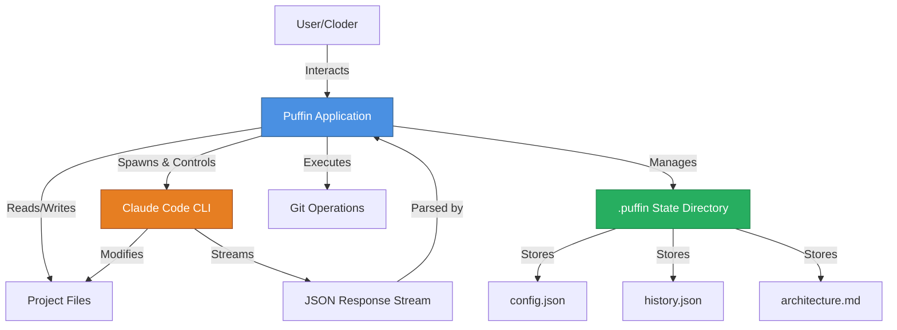

### 2.2 Multi-Process Architecture

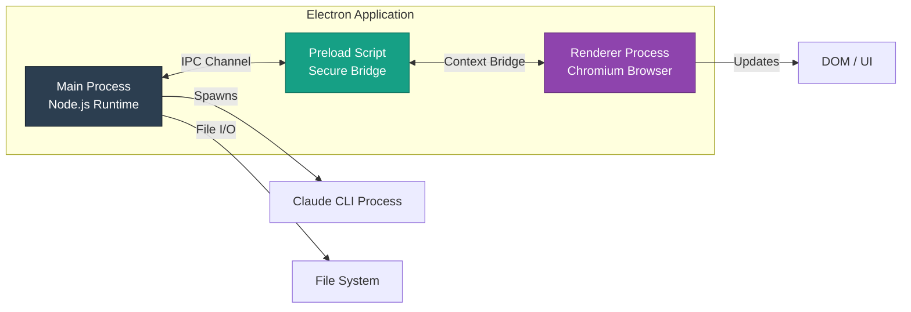

### 2.3 State Management (SAM Pattern)

```mermaid
stateDiagram-v2
    [*] --> Action: User Intent
    Action --> Model: Proposal
    Model --> State: Updated Model
    State --> View: State Representation
    View --> [*]: Rendered UI
    View --> Action: Next Action
    
    note right of Model
        Accepts/Rejects proposals
        Maintains invariants
        Single source of truth
    end note
    
    note right of State
        Derives representation
        Controls FSM transitions
        Triggers next actions
    end note
```


---

## 3. System Components

### 3.1 Main Process - Core

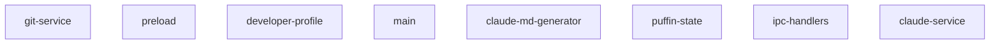

#### `src/main/git-service.js`

**Description:** Puffin - Git Service Provides Git repository operations for Puffin. Handles repository detection, branch management, staging, commits, and merges.

**Classes:** GitService
**Exports:** GitService, DEFAULT_GIT_SETTINGS

#### `src/main/preload.js`

**Description:** Puffin - Preload Script Exposes a safe API to the renderer process via contextBridge. This is the only bridge between the renderer and main process.

**Functions:** handler

#### `src/main/developer-profile.js`

**Description:** Developer Profile Manager Manages developer profile data stored globally in Electron's app data directory. This allows the profile to persist across different projects. Storage location: - Windows: %APPDATA%/puffin/developer-profile.json - macOS: ~/Library/Application Support/puffin/developer-profile.json - Linux: ~/.config/puffin/developer-profile.json GitHub Integration: - OAuth authentication using Device Flow (no server required) - Profile data sync with GitHub profile - Repository and activity fetching

**Classes:** DeveloperProfileManager
**Functions:** poll
**Exports:** DeveloperProfileManager, CODING_STYLE_OPTIONS, DEFAULT_PROFILE, GITHUB_CONFIG

#### `src/main/main.js`

**Description:** Puffin - Main Process Entry point for the Electron application. Handles window creation and IPC setup. Puffin opens a directory (like VSCode) and stores state in .puffin/

**Functions:** createMenu, createWindow, pickDirectory, getProjectPathFromArgs

#### `src/main/claude-md-generator.js`

**Description:** ClaudeMdGenerator - Generates dynamic CLAUDE.md files for target projects Maintains branch-specific context files that are concatenated into the active CLAUDE.md: - CLAUDE_base.md: Shared project context (description, assumptions, coding preferences) - CLAUDE_{branch}.md: Branch-specific focus and relevant data - CLAUDE.md: Active file = base + current branch content

**Classes:** ClaudeMdGenerator
**Exports:** ClaudeMdGenerator

#### `src/main/puffin-state.js`

**Description:** Puffin State Manager Manages the .puffin/ directory within a target project. All state is persisted automatically - no explicit save/load needed. Directory structure: .puffin/ ├── config.json       # Project configuration & options ├── history.json      # Prompt history & branches ├── architecture.md   # Architecture document └── gui-designs/      # Saved GUI design exports

**Classes:** PuffinState
**Functions:** debugLog
**Exports:** PuffinState

#### `src/main/ipc-handlers.js`

**Description:** Puffin - IPC Handlers Handles inter-process communication between main and renderer. Uses PuffinState for directory-based state management.

**Functions:** setupIpcHandlers, setupStateHandlers, regenerateUiBranchContext, setupClaudeHandlers, setupFileHandlers ... (+10 more)
**Exports:** setupIpcHandlers, setupPluginHandlers, setupPluginManagerHandlers, setupViewRegistryHandlers, setupPluginStyleHandlers

#### `src/main/claude-service.js`

**Description:** Puffin - Claude Service Spawns and manages the Claude Code CLI as a subprocess. Acts as the bridge between Puffin's management layer and the CLI. This gives Puffin the full capabilities of the CLI: - File read/write - Bash execution - Project awareness - Tool use and agentic loops - Integration with Puffin's management layer

**Classes:** ClaudeService
**Functions:** getToolEmoji, progress
**Exports:** ClaudeService

### 3.2 Main Process - Plugin System

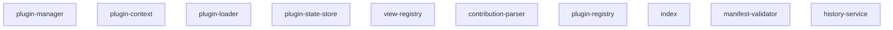

#### `src/main/plugins/plugin-manager.js`

**Description:** Plugin Manager Orchestrates plugin lifecycle: activation, deactivation, enable/disable. Coordinates between PluginLoader, PluginContext, PluginRegistry, and PluginStateStore.

**Classes:** PluginManager
**Functions:** if
**Exports:** PluginManager

#### `src/main/plugins/plugin-context.js`

**Description:** Plugin Context Provides a sandboxed API for plugins to interact with Puffin. Each plugin receives its own context instance during activation.

**Classes:** PluginContext
**Exports:** PluginContext

#### `src/main/plugins/plugin-loader.js`

**Description:** Plugin Loader Service Discovers and loads plugins from the ~/.puffin/plugins/ directory. Validates manifests, resolves dependencies, and emits lifecycle events.

**Classes:** Plugin, PluginLoader
**Exports:** PluginLoader, Plugin, PluginLoadState, PluginLifecycleState, an

#### `src/main/plugins/plugin-state-store.js`

**Description:** Plugin State Store Persists plugin enabled/disabled state across application restarts. Stores state in ~/.puffin/plugin-state.json

**Classes:** PluginStateStore
**Exports:** PluginStateStore

#### `src/main/plugins/view-registry.js`

**Description:** View Registry Central registry for plugin view contributions. Manages view registration, unregistration, and queries. Coordinates between plugin lifecycle and renderer notifications.

**Classes:** ViewRegistry
**Exports:** ViewRegistry

#### `src/main/plugins/contribution-parser.js`

**Description:** Contribution Parser Parses and validates plugin contributions from manifests. Handles view contributions, commands, menus, and other extension points.

**Functions:** parseViewContributions, validateViewContribution, logContributionErrors, getViewsByLocation, getViewLocations ... (+1 more)
**Exports:** parseViewContributions, validateViewContribution, logContributionErrors, getViewsByLocation, getViewLocations

#### `src/main/plugins/plugin-registry.js`

**Description:** Plugin Registry Central registry for tracking all plugin registrations. Enables plugin-to-plugin communication and provides access to registered handlers for the SAM pattern integration.

**Classes:** PluginRegistry
**Functions:** return
**Exports:** PluginRegistry

#### `src/main/plugins/index.js`

**Description:** Puffin Plugin System Main exports for the plugin system.

**Exports:** ManifestValidator, ManifestValidationError, PluginLoader, Plugin, PluginLoadState

#### `src/main/plugins/manifest-validator.js`

**Description:** Plugin Manifest Validator Validates puffin-plugin.json manifest files against the JSON schema. Provides developer-friendly error messages with field paths.

**Classes:** ManifestValidationError, ManifestValidator
**Exports:** ManifestValidator, ManifestValidationError

#### `src/main/plugins/services/history-service.js`

**Description:** History Service Provides read-only access to Puffin history data for plugins. Wraps PuffinState with a clean, documented API.

**Classes:** HistoryService
**Exports:** HistoryService

#### `src/main/plugins/services/index.js`

**Description:** Plugin Services Index Exports all services available to plugins via context.getService()

**Exports:** HistoryService

### 3.3 Renderer Process - Components


#### `src/renderer/components/user-story-review-modal/user-story-review-modal.js`

**Description:** User Story Review Modal Component Displays derived stories for review and iteration before implementation. Supports marking stories as ready, editing, deleting, and requesting changes.

**Classes:** UserStoryReviewModalComponent
**Exports:** UserStoryReviewModalComponent

#### `src/renderer/components/architecture/architecture.js`

**Description:** Architecture Component Manages the architecture document with Claude review integration.

**Classes:** ArchitectureComponent
**Exports:** ArchitectureComponent

#### `src/renderer/components/story-generations/story-generations.js`

**Description:** Story Generations Component (Insights View) Displays history of how Claude decomposed prompts into stories, user feedback on generated stories, and implementation journey outcomes.

**Classes:** StoryGenerationsComponent
**Exports:** StoryGenerationsComponent

#### `src/renderer/components/user-stories/user-stories.js`

**Description:** User Stories Component Manages user stories extracted from specification prompts. Stories can be manually added or auto-extracted from specifications branch.

**Classes:** UserStoriesComponent
**Exports:** UserStoriesComponent

#### `src/renderer/components/history-tree/history-tree.js`

**Description:** History Tree Component Displays hierarchical prompt history organized by branches. Allows navigation through prompt history and branch management.

**Classes:** HistoryTreeComponent
**Functions:** closeHandler
**Exports:** HistoryTreeComponent

#### `src/renderer/components/debugger/debugger.js`

**Description:** SAM Debugger UI Component Provides a visual interface for: - Viewing action history - Inspecting state at each step - Viewing control states - Time travel navigation

**Classes:** DebuggerComponent
**Functions:** stateClass
**Exports:** DebuggerComponent

#### `src/renderer/components/cli-output/cli-output.js`

**Description:** CLI Output Component Displays raw 3CLI interactions including: - Live streaming output - Parsed message history - Raw JSON for debugging

**Classes:** CliOutputComponent
**Exports:** CliOutputComponent

#### `src/renderer/components/developer-profile/developer-profile.js`

**Description:** Developer Profile Component Manages developer profile with GitHub integration: - Profile creation and editing - GitHub OAuth authentication - Repository and activity display - Profile import/export

**Classes:** DeveloperProfileComponent
**Exports:** DeveloperProfileComponent, profile

#### `src/renderer/components/project-form/project-form.js`

**Description:** Project Form Component Handles the project configuration form including: - Project name and description - Assumptions list - Technical architecture - Data model - Claude guidance options Now uses config state from .puffin/config.json

**Classes:** ProjectFormComponent
**Exports:** ProjectFormComponent

#### `src/renderer/components/response-viewer/response-viewer.js`

**Description:** Response Viewer Component Displays Claude's responses with markdown rendering and streaming support.

**Classes:** ResponseViewerComponent
**Functions:** parseCells
**Exports:** ResponseViewerComponent

#### `src/renderer/components/prompt-editor/prompt-editor.js`

**Description:** Prompt Editor Component Handles prompt input and submission to Claude.

**Classes:** PromptEditorComponent
**Functions:** describeElement
**Exports:** PromptEditorComponent

#### `src/renderer/components/git-panel/git-panel.js`

**Description:** Puffin Git Panel Component A comprehensive Git integration panel that provides: - Repository status display - Branch management (create, switch, delete) - File staging and committing - Merge workflow with conflict detection - Git operation history Developer-friendly with intuitive UX and clear feedback.

**Classes:** GitPanelComponent
**Exports:** GitPanelComponent

#### `src/renderer/components/gui-designer/gui-designer.js`

**Description:** GUI Designer Component Visual interface for designing UI layouts that can be described to Claude for implementation guidance.

**Classes:** GuiDesignerComponent
**Functions:** updateProps, describe
**Exports:** GuiDesignerComponent, modal

### 3.4 Renderer Process - Core

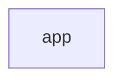

#### `src/renderer/app.js`

**Description:** Puffin - Application Bootstrap Main entry point for the renderer process. Initializes SAM and wires up all components. Directory-based workflow: Puffin opens a directory and reads/writes .puffin/

**Classes:** PuffinApp
**Functions:** toActionType

### 3.5 Renderer Process - Libraries

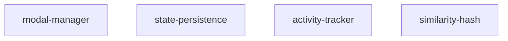

#### `src/renderer/lib/modal-manager.js`

**Description:** Modal Manager Handles rendering and management of modal dialogs. Extracted from app.js for better separation of concerns.

**Classes:** ModalManager
**Functions:** isStale
**Exports:** ModalManager

#### `src/renderer/lib/state-persistence.js`

**Description:** State Persistence Manager Handles persisting state changes to the .puffin/ directory. Extracted from app.js for better separation of concerns.

**Classes:** StatePersistence
**Exports:** StatePersistence

#### `src/renderer/lib/activity-tracker.js`

**Description:** Activity Tracker Tracks Claude CLI tool execution for activity monitoring. Extracted from app.js for better separation of concerns.

**Classes:** ActivityTracker
**Exports:** ActivityTracker

#### `src/renderer/lib/similarity-hash.js`

**Description:** Similarity Hash Utility for Stuck Detection Generates hashes from response content to detect when Claude is "stuck" producing similar outputs repeatedly.

**Functions:** computeSimilarityHash, simpleHash, generateOutputSummary
**Exports:** computeSimilarityHash, generateOutputSummary

### 3.6 Renderer Process - Plugin System

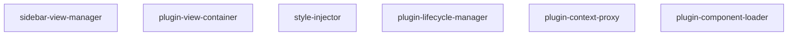

#### `src/renderer/plugins/sidebar-view-manager.js`

**Description:** Sidebar View Manager Manages plugin sidebar tabs, nav tabs, and view switching. Integrates with the ViewRegistry via IPC to dynamically add/remove plugin views.

**Classes:** SidebarViewManager
**Exports:** SidebarViewManager, sidebarViewManager

#### `src/renderer/plugins/plugin-view-container.js`

**Description:** Plugin View Container Manages the rendering and lifecycle of plugin view content. Handles loading plugin components and rendering them in the view area.

**Classes:** PluginViewContainer
**Functions:** if
**Exports:** PluginViewContainer, pluginViewContainer

#### `src/renderer/plugins/style-injector.js`

**Description:** Plugin Style Injector Handles CSS injection and removal for plugins. Manages plugin stylesheets with proper scoping and cleanup.

**Classes:** StyleInjector
**Exports:** StyleInjector, styleInjector

#### `src/renderer/plugins/plugin-lifecycle-manager.js`

**Description:** Plugin Lifecycle Manager Orchestrates lifecycle hooks for plugin components. Handles onActivate, onDeactivate, and onDestroy callbacks with proper async handling, timeouts, and error catching.

**Classes:** PluginLifecycleManager
**Exports:** PluginLifecycleManager, pluginLifecycleManager

#### `src/renderer/plugins/plugin-context-proxy.js`

**Description:** Plugin Context Proxy Creates renderer-side context objects for plugin components. Provides access to plugin metadata and proxied storage operations via IPC.

**Classes:** PluginContextProxy, SimpleEventBus
**Functions:** return, wrappedHandler
**Exports:** PluginContextProxy, pluginContextProxy

#### `src/renderer/plugins/plugin-component-loader.js`

**Description:** Plugin Component Loader Dynamically loads plugin renderer components from their entry points. Handles ES module loading, component registration, and cleanup.

**Classes:** PluginComponentLoader
**Exports:** PluginComponentLoader, pluginComponentLoader

### 3.7 Renderer Process - SAM Pattern

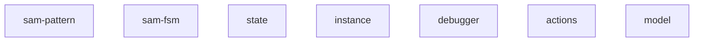

#### `src/renderer/lib/sam-pattern.js`

**Description:** SAM Pattern - ES Module Wrapper Wraps the UMD bundle for use in browser ES modules

**Classes:** t, w
**Functions:** a, G, L, M, P ... (+20 more)
**Exports:** createInstance, SAM, on, oneOf, first

#### `src/renderer/lib/sam-fsm.js`

**Description:** SAM FSM - ES Module Wrapper Wraps the UMD bundle for use in browser ES modules

**Functions:** a, b, c, d, e ... (+15 more)
**Exports:** fsm, tpFSM

#### `src/renderer/sam/state.js`

**Description:** Puffin SAM State State computes the view representation from the model. It derives computed properties and determines what to render. Directory-based workflow - state is loaded from .puffin/

**Functions:** computeState, computeAppState, computeConfigState, computePromptState, computeHistoryState ... (+11 more)
**Exports:** computeState, reactors, render

#### `src/renderer/sam/instance.js`

**Description:** Puffin SAM Instance This module creates and exports the main SAM instance for the application. SAM (State-Action-Model) provides a unidirectional data flow pattern based on TLA+ semantics. Simplified for directory-based workflow - no project selection needed.

**Exports:** SAM, appFsm, promptFsm, fsms

#### `src/renderer/sam/debugger.js`

**Description:** Puffin SAM Debugger Provides debugging capabilities for the SAM pattern: - Action history with timestamps - State snapshots - Control state visualization - Time travel (restore previous states)

**Classes:** SAMDebugger
**Exports:** SAMDebugger, samDebugger

#### `src/renderer/sam/actions.js`

**Description:** Puffin SAM Actions Actions are pure functions that compute proposals based on user intent. They don't mutate state directly - they propose changes to the model.

**Functions:** initializeApp, loadState, appError, recover, updateConfig ... (+107 more)
**Exports:** initializeApp, loadState, appError, recover, updateConfig

#### `src/renderer/sam/model.js`

**Description:** Puffin SAM Model (Acceptors) Acceptors validate and apply proposals to the model. They ensure the model remains consistent and valid. State is automatically persisted to .puffin/ directory via IPC. No explicit save/load - Puffin opens a directory and state is always synced.

**Functions:** findStoryIdsForPrompt, buildUiBranchContext, buildArchitectureBranchContext, buildBackendBranchContext, findPromptById ... (+3 more)
**Exports:** initialModel, initializeAcceptor, loadStateAcceptor, appErrorAcceptor, recoverAcceptor

### 3.8 Shared Utilities

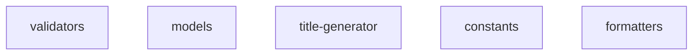

#### `src/shared/validators.js`

**Description:** Puffin Validators

**Functions:** validateProject, validatePrompt, validateGuiElement, validateBranch, sanitizeString ... (+1 more)
**Exports:** validateProject, validatePrompt, validateGuiElement, validateBranch, sanitizeString

#### `src/shared/models.js`

**Description:** Available Claude models for Puffin These are the models available through Claude Code CLI. Users can select a default model in settings and override per-thread.

**Exports:** CLAUDE_MODELS, DEFAULT_MODEL, FAST_MODEL

#### `src/shared/title-generator.js`

**Description:** Title Generator Service Generates concise titles for prompts using Claude API

**Functions:** generateTitle, generateTitleWithClaude, generateFallbackTitle
**Exports:** async

#### `src/shared/constants.js`

**Description:** Puffin Constants

**Exports:** BRANCH_TYPES, PROGRAMMING_STYLES, TESTING_APPROACHES, DOCUMENTATION_LEVELS, ERROR_HANDLING

#### `src/shared/formatters.js`

**Description:** Puffin Formatters

**Functions:** generateId, formatDate, formatRelativeTime, truncate, formatFileSize ... (+5 more)
**Exports:** generateId, formatDate, formatRelativeTime, truncate, formatFileSize


---

## 4. State Machine Specifications

### 4.1 Application FSM

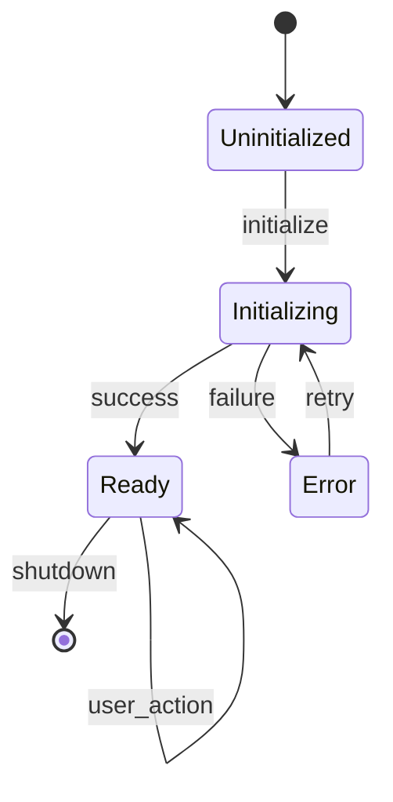

**States:**
- `Uninitialized`: No project loaded
- `Initializing`: Loading project configuration
- `Ready`: Application ready for user interaction
- `Error`: Initialization failed

**Transitions:**
- `initialize`: Load project and configuration
- `success`: Configuration loaded successfully
- `failure`: Configuration load failed
- `user_action`: Any valid user action in ready state
- `retry`: Attempt to reinitialize after error

### 4.2 Prompt Execution FSM

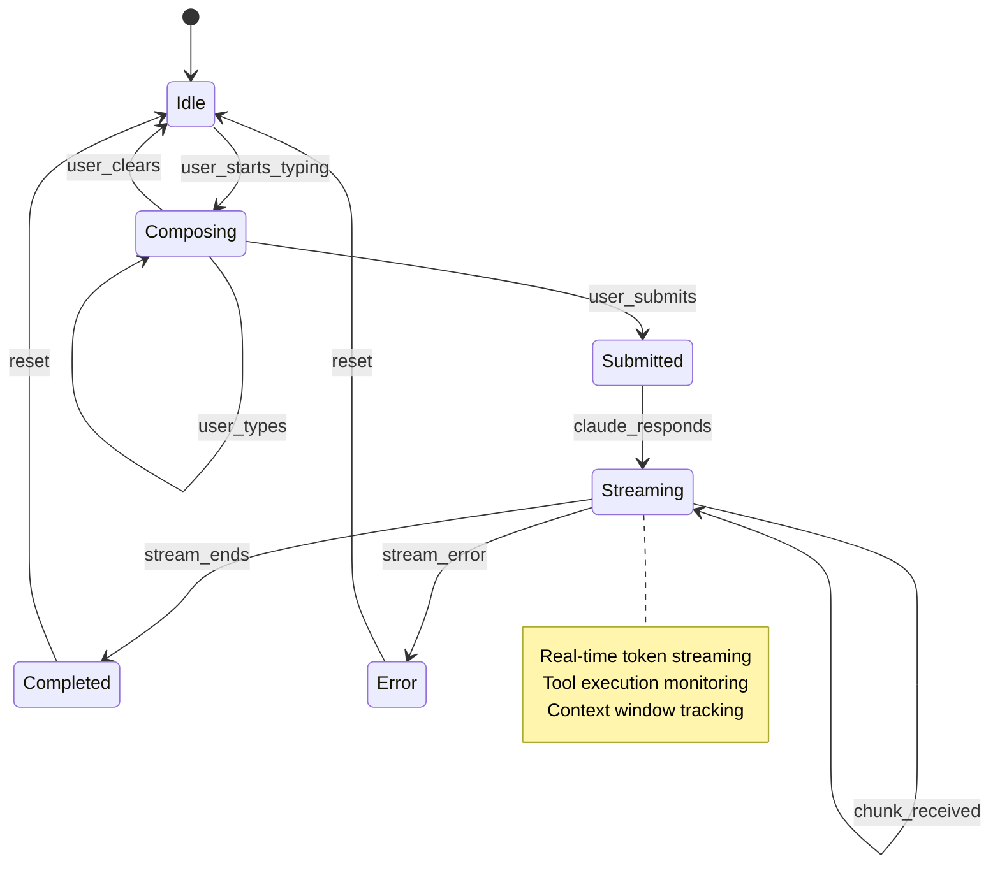

**States:**
- `Idle`: No active prompt
- `Composing`: User typing prompt
- `Submitted`: Prompt sent to Claude CLI
- `Streaming`: Receiving response stream
- `Completed`: Response fully received
- `Error`: Error during prompt execution

### 4.3 User Story Lifecycle

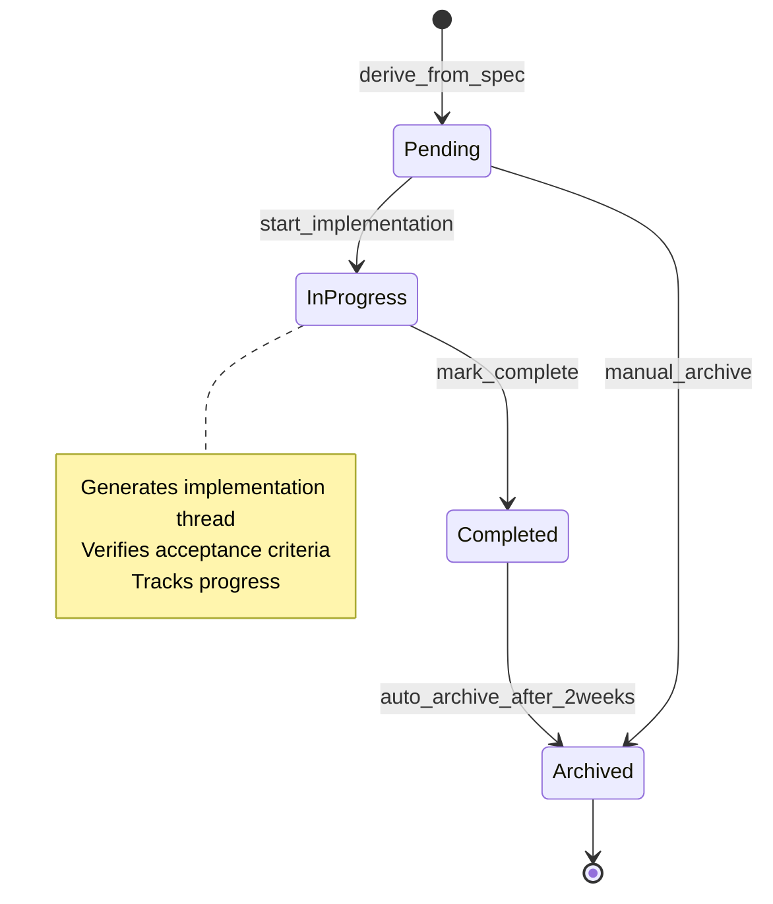


---

## 5. Refinement Layers (B-Method Style)

### Refinement Level 0: Abstract Specification

**Abstract State:**
```
STATE = ⟨ project, history, stories ⟩
```

**Abstract Operations:**
```
• initialize(path) → STATE
• prompt(text) → RESPONSE
• manage_stories(operation) → STORIES
```

### Refinement Level 1: Process Architecture

**Refined State:**
```
STATE = ⟨ main_process, renderer_process, ipc_channel ⟩

main_process = ⟨ claude_service, puffin_state, ipc_handlers ⟩
renderer_process = ⟨ sam_model, sam_state, components ⟩
ipc_channel = ⟨ requests, responses, events ⟩
```

**Refined Operations:**
```
initialize(path) =̂
    main_process.load_configuration(path) ∥
    main_process.initialize_claude_service() ∥
    renderer_process.render_initial_view()

prompt(text) =̂
    renderer_process.dispatch_action(submit_prompt, text) ⟹
    ipc_channel.send_request(execute_prompt, text) ⟹
    main_process.claude_service.spawn_process(text) ⟹
    main_process.stream_response() ⟹
    ipc_channel.send_events(response_chunks) ⟹
    renderer_process.update_view()
```

### Refinement Level 2: Component Implementation

**Components mapped to files:**

```
main_process.claude_service ↦ src/main/claude-service.js
main_process.puffin_state ↦ src/main/puffin-state.js
main_process.ipc_handlers ↦ src/main/ipc-handlers.js
renderer_process.sam_model ↦ src/renderer/sam/model.js
renderer_process.sam_state ↦ src/renderer/sam/state.js
renderer_process.components.prompt ↦ src/renderer/components/prompt-editor/
```

### Refinement Verification

**Proof Obligations:**
1. Each refinement preserves abstract invariants
2. Each refined operation simulates abstract operation
3. No new deadlocks introduced at lower levels
4. All concrete states map to valid abstract states

```
∀ concrete_state ∈ CONCRETE_STATE:
    ∃ abstract_state ∈ ABSTRACT_STATE:
        abstraction(concrete_state) = abstract_state ∧
        satisfies_invariants(abstract_state)
```


---

## 6. Module Catalog

Complete listing of all modules with their specifications.

### 6.1 Main Process - Core

#### src/main/claude-md-generator.js

ClaudeMdGenerator - Generates dynamic CLAUDE.md files for target projects Maintains branch-specific context files that are concatenated into the active CLAUDE.md: - CLAUDE_base.md: Shared project context (description, assumptions, coding preferences) - CLAUDE_{branch}.md: Branch-specific focus and relevant data - CLAUDE.md: Active file = base + current branch content

**Classes:**
- `ClaudeMdGenerator`

**Dependencies:** 2 imports

**Exports:** ClaudeMdGenerator

---

#### src/main/claude-service.js

Puffin - Claude Service Spawns and manages the Claude Code CLI as a subprocess. Acts as the bridge between Puffin's management layer and the CLI. This gives Puffin the full capabilities of the CLI: - File read/write - Bash execution - Project awareness - Tool use and agentic loops - Integration with Puffin's management layer

**Classes:**
- `ClaudeService`

**Functions:** 2
- `getToolEmoji()`
- `progress()`

**Constants:** TOOL_EMOJIS

**Dependencies:** 3 imports

**Exports:** ClaudeService

---

#### src/main/developer-profile.js

Developer Profile Manager Manages developer profile data stored globally in Electron's app data directory. This allows the profile to persist across different projects. Storage location: - Windows: %APPDATA%/puffin/developer-profile.json - macOS: ~/Library/Application Support/puffin/developer-profile.json - Linux: ~/.config/puffin/developer-profile.json GitHub Integration: - OAuth authentication using Device Flow (no server required) - Profile data sync with GitHub profile - Repository and activity fetching

**Classes:**
- `DeveloperProfileManager`

**Functions:** 1
- `poll()`

**Constants:** PROFILE_FILE, GITHUB_CREDENTIALS_FILE, GITHUB_CONFIG, DEFAULT_PROFILE, CODING_STYLE_OPTIONS

**Dependencies:** 4 imports

**Exports:** DeveloperProfileManager, CODING_STYLE_OPTIONS, DEFAULT_PROFILE, GITHUB_CONFIG

---

#### src/main/git-service.js

Puffin - Git Service Provides Git repository operations for Puffin. Handles repository detection, branch management, staging, commits, and merges.

**Classes:**
- `GitService`

**Constants:** BRANCH_NAME_REGEX, DEFAULT_GIT_SETTINGS

**Dependencies:** 3 imports

**Exports:** GitService, DEFAULT_GIT_SETTINGS

---

#### src/main/ipc-handlers.js

Puffin - IPC Handlers Handles inter-process communication between main and renderer. Uses PuffinState for directory-based state management.

**Functions:** 15
- `setupIpcHandlers()`
- `setupStateHandlers()`
- `regenerateUiBranchContext()`
- `setupClaudeHandlers()`
- `setupFileHandlers()`
- `setupProfileHandlers()`
- `setupGitHandlers()`
- `setupShellHandlers()`
- `setupPluginHandlers()`
- `setupPluginManagerHandlers()`
- ... and 5 more

**Dependencies:** 11 imports

**Exports:** setupIpcHandlers, setupPluginHandlers, setupPluginManagerHandlers, setupViewRegistryHandlers, setupPluginStyleHandlers, getPuffinState

---

#### src/main/main.js

Puffin - Main Process Entry point for the Electron application. Handles window creation and IPC setup. Puffin opens a directory (like VSCode) and stores state in .puffin/

**Functions:** 4
- `createMenu()`
- `createWindow()`
- `pickDirectory()`
- `getProjectPathFromArgs()`

**Dependencies:** 7 imports

---

#### src/main/preload.js

Puffin - Preload Script Exposes a safe API to the renderer process via contextBridge. This is the only bridge between the renderer and main process.

**Functions:** 1
- `handler()`

**Dependencies:** 1 imports

---

#### src/main/puffin-state.js

Puffin State Manager Manages the .puffin/ directory within a target project. All state is persisted automatically - no explicit save/load needed. Directory structure: .puffin/ ├── config.json       # Project configuration & options ├── history.json      # Prompt history & branches ├── architecture.md   # Architecture document └── gui-designs/      # Saved GUI design exports

**Classes:**
- `PuffinState`

**Functions:** 1
- `debugLog()`

**Constants:** PUFFIN_DIR, CONFIG_FILE, HISTORY_FILE, ARCHITECTURE_FILE, USER_STORIES_FILE, ARCHIVED_STORIES_FILE, ACTIVE_SPRINT_FILE, STORY_GENERATIONS_FILE, GIT_OPERATIONS_FILE, GUI_DESIGNS_DIR, GUI_DEFINITIONS_DIR, UI_GUIDELINES_FILE, STYLESHEETS_DIR, TWO_WEEKS_MS

**Dependencies:** 2 imports

**Exports:** PuffinState

---

### 6.2 Main Process - Plugin System

#### src/main/plugins/contribution-parser.js

Contribution Parser Parses and validates plugin contributions from manifests. Handles view contributions, commands, menus, and other extension points.

**Functions:** 6
- `parseViewContributions()`
- `validateViewContribution()`
- `logContributionErrors()`
- `getViewsByLocation()`
- `getViewLocations()`
- `mergeViewContributions()`

**Constants:** VALID_VIEW_LOCATIONS

**Exports:** parseViewContributions, validateViewContribution, logContributionErrors, getViewsByLocation, getViewLocations, mergeViewContributions, VALID_VIEW_LOCATIONS

---

#### src/main/plugins/index.js

Puffin Plugin System Main exports for the plugin system.

**Dependencies:** 9 imports

**Exports:** ManifestValidator, ManifestValidationError, PluginLoader, Plugin, PluginLoadState, PluginLifecycleState, PluginContext, PluginRegistry, PluginStateStore, PluginManager, ViewRegistry, HistoryService, // Contribution parser exports
  parseViewContributions, validateViewContribution, logContributionErrors, getViewsByLocation, getViewLocations, mergeViewContributions, VALID_VIEW_LOCATIONS

---

#### src/main/plugins/manifest-validator.js

Plugin Manifest Validator Validates puffin-plugin.json manifest files against the JSON schema. Provides developer-friendly error messages with field paths.

**Classes:**
- `ManifestValidationError` extends Error
- `ManifestValidator`

**Dependencies:** 5 imports

**Exports:** ManifestValidator, ManifestValidationError

---

#### src/main/plugins/plugin-context.js

Plugin Context Provides a sandboxed API for plugins to interact with Puffin. Each plugin receives its own context instance during activation.

**Classes:**
- `PluginContext`

**Dependencies:** 3 imports

**Exports:** PluginContext

---

#### src/main/plugins/plugin-loader.js

Plugin Loader Service Discovers and loads plugins from the ~/.puffin/plugins/ directory. Validates manifests, resolves dependencies, and emits lifecycle events.

**Classes:**
- `Plugin`
- `PluginLoader` extends EventEmitter

**Dependencies:** 6 imports

**Exports:** PluginLoader, Plugin, PluginLoadState, PluginLifecycleState, an

---

#### src/main/plugins/plugin-manager.js

Plugin Manager Orchestrates plugin lifecycle: activation, deactivation, enable/disable. Coordinates between PluginLoader, PluginContext, PluginRegistry, and PluginStateStore.

**Classes:**
- `PluginManager` extends EventEmitter

**Functions:** 1
- `if()`

**Dependencies:** 6 imports

**Exports:** PluginManager

---

#### src/main/plugins/plugin-registry.js

Plugin Registry Central registry for tracking all plugin registrations. Enables plugin-to-plugin communication and provides access to registered handlers for the SAM pattern integration.

**Classes:**
- `PluginRegistry` extends EventEmitter

**Functions:** 1
- `return()`

**Dependencies:** 1 imports

**Exports:** PluginRegistry

---

#### src/main/plugins/plugin-state-store.js

Plugin State Store Persists plugin enabled/disabled state across application restarts. Stores state in ~/.puffin/plugin-state.json

**Classes:**
- `PluginStateStore`

**Dependencies:** 3 imports

**Exports:** PluginStateStore

---

#### src/main/plugins/services/history-service.js

History Service Provides read-only access to Puffin history data for plugins. Wraps PuffinState with a clean, documented API.

**Classes:**
- `HistoryService`

**Exports:** HistoryService

---

#### src/main/plugins/services/index.js

Plugin Services Index Exports all services available to plugins via context.getService()

**Dependencies:** 1 imports

**Exports:** HistoryService

---

#### src/main/plugins/view-registry.js

View Registry Central registry for plugin view contributions. Manages view registration, unregistration, and queries. Coordinates between plugin lifecycle and renderer notifications.

**Classes:**
- `ViewRegistry` extends EventEmitter

**Dependencies:** 2 imports

**Exports:** ViewRegistry

---

### 6.3 Renderer Process - Components

#### src/renderer/components/architecture/architecture.js

Architecture Component Manages the architecture document with Claude review integration.

**Classes:**
- `ArchitectureComponent`

**Exports:** ArchitectureComponent

---

#### src/renderer/components/cli-output/cli-output.js

CLI Output Component Displays raw 3CLI interactions including: - Live streaming output - Parsed message history - Raw JSON for debugging

**Classes:**
- `CliOutputComponent`

**Constants:** TOOL_EMOJIS

**Exports:** CliOutputComponent

---

#### src/renderer/components/debugger/debugger.js

SAM Debugger UI Component Provides a visual interface for: - Viewing action history - Inspecting state at each step - Viewing control states - Time travel navigation

**Classes:**
- `DebuggerComponent`

**Functions:** 1
- `stateClass()`

**Dependencies:** 1 imports

**Exports:** DebuggerComponent

---

#### src/renderer/components/developer-profile/developer-profile.js

Developer Profile Component Manages developer profile with GitHub integration: - Profile creation and editing - GitHub OAuth authentication - Repository and activity display - Profile import/export

**Classes:**
- `DeveloperProfileComponent`

**Exports:** DeveloperProfileComponent, profile

---

#### src/renderer/components/git-panel/git-panel.js

Puffin Git Panel Component A comprehensive Git integration panel that provides: - Repository status display - Branch management (create, switch, delete) - File staging and committing - Merge workflow with conflict detection - Git operation history Developer-friendly with intuitive UX and clear feedback.

**Classes:**
- `GitPanelComponent`

**Exports:** GitPanelComponent

---

#### src/renderer/components/gui-designer/gui-designer.js

GUI Designer Component Visual interface for designing UI layouts that can be described to Claude for implementation guidance.

**Classes:**
- `GuiDesignerComponent`

**Functions:** 2
- `updateProps()`
- `describe()`

**Exports:** GuiDesignerComponent, modal

---

#### src/renderer/components/history-tree/history-tree.js

History Tree Component Displays hierarchical prompt history organized by branches. Allows navigation through prompt history and branch management.

**Classes:**
- `HistoryTreeComponent`

**Functions:** 1
- `closeHandler()`

**Exports:** HistoryTreeComponent

---

#### src/renderer/components/project-form/project-form.js

Project Form Component Handles the project configuration form including: - Project name and description - Assumptions list - Technical architecture - Data model - Claude guidance options Now uses config state from .puffin/config.json

**Classes:**
- `ProjectFormComponent`

**Exports:** ProjectFormComponent

---

#### src/renderer/components/prompt-editor/prompt-editor.js

Prompt Editor Component Handles prompt input and submission to Claude.

**Classes:**
- `PromptEditorComponent`

**Functions:** 1
- `describeElement()`

**Exports:** PromptEditorComponent

---

#### src/renderer/components/response-viewer/response-viewer.js

Response Viewer Component Displays Claude's responses with markdown rendering and streaming support.

**Classes:**
- `ResponseViewerComponent`

**Functions:** 1
- `parseCells()`

**Exports:** ResponseViewerComponent

---

#### src/renderer/components/story-generations/story-generations.js

Story Generations Component (Insights View) Displays history of how Claude decomposed prompts into stories, user feedback on generated stories, and implementation journey outcomes.

**Classes:**
- `StoryGenerationsComponent`

**Exports:** StoryGenerationsComponent

---

#### src/renderer/components/user-stories/user-stories.js

User Stories Component Manages user stories extracted from specification prompts. Stories can be manually added or auto-extracted from specifications branch.

**Classes:**
- `UserStoriesComponent`

**Constants:** SEARCH_MIN_CHARS, SEARCH_DEBOUNCE_MS

**Exports:** UserStoriesComponent

---

#### src/renderer/components/user-story-review-modal/user-story-review-modal.js

User Story Review Modal Component Displays derived stories for review and iteration before implementation. Supports marking stories as ready, editing, deleting, and requesting changes.

**Classes:**
- `UserStoryReviewModalComponent`

**Exports:** UserStoryReviewModalComponent

---

### 6.4 Renderer Process - Core

#### src/renderer/app.js

Puffin - Application Bootstrap Main entry point for the renderer process. Initializes SAM and wires up all components. Directory-based workflow: Puffin opens a directory and reads/writes .puffin/

**Classes:**
- `PuffinApp`

**Functions:** 1
- `toActionType()`

**Dependencies:** 25 imports

---

### 6.5 Renderer Process - Libraries

#### src/renderer/lib/activity-tracker.js

Activity Tracker Tracks Claude CLI tool execution for activity monitoring. Extracted from app.js for better separation of concerns.

**Classes:**
- `ActivityTracker`

**Exports:** ActivityTracker

---

#### src/renderer/lib/modal-manager.js

Modal Manager Handles rendering and management of modal dialogs. Extracted from app.js for better separation of concerns.

**Classes:**
- `ModalManager`

**Functions:** 1
- `isStale()`

**Exports:** ModalManager

---

#### src/renderer/lib/similarity-hash.js

Similarity Hash Utility for Stuck Detection Generates hashes from response content to detect when Claude is "stuck" producing similar outputs repeatedly.

**Functions:** 3
- `computeSimilarityHash()`
- `simpleHash()`
- `generateOutputSummary()`

**Exports:** computeSimilarityHash, generateOutputSummary

---

#### src/renderer/lib/state-persistence.js

State Persistence Manager Handles persisting state changes to the .puffin/ directory. Extracted from app.js for better separation of concerns.

**Classes:**
- `StatePersistence`

**Exports:** StatePersistence

---

### 6.6 Renderer Process - Plugin System

#### src/renderer/plugins/plugin-component-loader.js

Plugin Component Loader Dynamically loads plugin renderer components from their entry points. Handles ES module loading, component registration, and cleanup.

**Classes:**
- `PluginComponentLoader`

**Constants:** LOAD_TIMEOUT

**Dependencies:** 1 imports

**Exports:** PluginComponentLoader, pluginComponentLoader

---

#### src/renderer/plugins/plugin-context-proxy.js

Plugin Context Proxy Creates renderer-side context objects for plugin components. Provides access to plugin metadata and proxied storage operations via IPC.

**Classes:**
- `PluginContextProxy`
- `SimpleEventBus`

**Functions:** 2
- `return()`
- `wrappedHandler()`

**Exports:** PluginContextProxy, pluginContextProxy

---

#### src/renderer/plugins/plugin-lifecycle-manager.js

Plugin Lifecycle Manager Orchestrates lifecycle hooks for plugin components. Handles onActivate, onDeactivate, and onDestroy callbacks with proper async handling, timeouts, and error catching.

**Classes:**
- `PluginLifecycleManager`

**Constants:** LIFECYCLE_TIMEOUT

**Exports:** PluginLifecycleManager, pluginLifecycleManager

---

#### src/renderer/plugins/plugin-view-container.js

Plugin View Container Manages the rendering and lifecycle of plugin view content. Handles loading plugin components and rendering them in the view area.

**Classes:**
- `PluginViewContainer`

**Functions:** 1
- `if()`

**Dependencies:** 2 imports

**Exports:** PluginViewContainer, pluginViewContainer

---

#### src/renderer/plugins/sidebar-view-manager.js

Sidebar View Manager Manages plugin sidebar tabs, nav tabs, and view switching. Integrates with the ViewRegistry via IPC to dynamically add/remove plugin views.

**Classes:**
- `SidebarViewManager`

**Dependencies:** 1 imports

**Exports:** SidebarViewManager, sidebarViewManager

---

#### src/renderer/plugins/style-injector.js

Plugin Style Injector Handles CSS injection and removal for plugins. Manages plugin stylesheets with proper scoping and cleanup.

**Classes:**
- `StyleInjector`

**Exports:** StyleInjector, styleInjector

---

### 6.7 Renderer Process - SAM Pattern

#### src/renderer/lib/sam-fsm.js

SAM FSM - ES Module Wrapper Wraps the UMD bundle for use in browser ES modules

**Functions:** 20
- `a()`
- `b()`
- `c()`
- `d()`
- `e()`
- `f()`
- `g()`
- `h()`
- `i()`
- `j()`
- ... and 10 more

**Exports:** fsm, tpFSM

---

#### src/renderer/lib/sam-pattern.js

SAM Pattern - ES Module Wrapper Wraps the UMD bundle for use in browser ES modules

**Classes:**
- `t`
- `w`

**Functions:** 25
- `a()`
- `G()`
- `L()`
- `M()`
- `P()`
- `g()`
- `T()`
- `U()`
- `V()`
- `W()`
- ... and 15 more

**Constants:** G, L, M, N, O, P, Q, R, S, T, U, V, W, A, B, SAM

**Exports:** createInstance, SAM, on, oneOf, first, utils, tp

---

#### src/renderer/sam/actions.js

Puffin SAM Actions Actions are pure functions that compute proposals based on user intent. They don't mutate state directly - they propose changes to the model.

**Functions:** 112
- `initializeApp()`
- `loadState()`
- `appError()`
- `recover()`
- `updateConfig()`
- `updateOptions()`
- `startCompose()`
- `updatePromptContent()`
- `submitPrompt()`
- `receiveResponseChunk()`
- ... and 102 more

**Dependencies:** 1 imports

**Exports:** initializeApp, loadState, appError, recover, updateConfig, updateOptions, startCompose, updatePromptContent, submitPrompt, receiveResponseChunk, completeResponse, responseError, cancelPrompt, rerunPrompt, clearRerunRequest, selectBranch, createBranch, deleteBranch, selectPrompt, addGuiElement, updateGuiElement, deleteGuiElement, moveGuiElement, resizeGuiElement, selectGuiElement, clearGuiCanvas, exportGuiDescription, saveGuiDefinition, loadGuiDefinition, listGuiDefinitions, deleteGuiDefinition, showGuiDefinitionDialog, showSaveGuiDefinitionDialog, updateArchitecture, reviewArchitecture, addUserStory, updateUserStory, deleteUserStory, loadUserStories, deriveUserStories, receiveDerivedStories, markStoryReady, unmarkStoryReady, updateDerivedStory, deleteDerivedStory, requestStoryChanges, addStoriesToBacklog, cancelStoryReview, storyDerivationError, loadStoryGenerations, createStoryGeneration, updateGeneratedStoryFeedback, finalizeStoryGeneration, createImplementationJourney, addImplementationInput, updateImplementationJourney, completeImplementationJourney, switchView, toggleSidebar, showModal, hideModal, setCurrentTool, clearCurrentTool, addModifiedFile, clearModifiedFiles, setActivityStatus, toolStart, toolEnd, clearActivity, startGithubAuth, githubAuthSuccess, githubAuthError, githubLogout, loadGithubRepositories, selectGithubRepository, loadGithubActivity, updateGithubContributions, updateGithubSettings, updateGithubRateLimit, loadDeveloperProfile, toggleThreadExpanded, markThreadComplete, unmarkThreadComplete, showHandoffReview, updateHandoffSummary, completeHandoff, cancelHandoff, deleteHandoff, setBranchHandoffContext, clearBranchHandoffContext, createSprint, startSprintPlanning, approvePlan, clearSprint, clearPendingSprintPlanning, startSprintStoryImplementation, clearPendingStoryImplementation, completeStoryBranch, updateSprintStoryStatus, clearSprintError, recordIterationOutput, resolveStuckState, resetStuckDetection, clearActiveImplementationStory, toggleCriteriaCompletion, generateCommitMessage, receiveCommitMessage, commitMessageError, storeDebugPrompt, clearDebugPrompt, setDebugMode, updateThreadSearchQuery

---

#### src/renderer/sam/debugger.js

Puffin SAM Debugger Provides debugging capabilities for the SAM pattern: - Action history with timestamps - State snapshots - Control state visualization - Time travel (restore previous states)

**Classes:**
- `SAMDebugger`

**Exports:** SAMDebugger, samDebugger

---

#### src/renderer/sam/instance.js

Puffin SAM Instance This module creates and exports the main SAM instance for the application. SAM (State-Action-Model) provides a unidirectional data flow pattern based on TLA+ semantics. Simplified for directory-based workflow - no project selection needed.

**Constants:** SAM

**Dependencies:** 3 imports

**Exports:** SAM, appFsm, promptFsm, fsms

---

#### src/renderer/sam/model.js

Puffin SAM Model (Acceptors) Acceptors validate and apply proposals to the model. They ensure the model remains consistent and valid. State is automatically persisted to .puffin/ directory via IPC. No explicit save/load - Puffin opens a directory and state is always synced.

**Functions:** 8
- `findStoryIdsForPrompt()`
- `buildUiBranchContext()`
- `buildArchitectureBranchContext()`
- `buildBackendBranchContext()`
- `findPromptById()`
- `buildStoryImplementationPrompt()`
- `buildHandoffSummary()`
- `truncateText()`

**Constants:** MAX_SPRINT_STORIES

**Dependencies:** 1 imports

**Exports:** initialModel, initializeAcceptor, loadStateAcceptor, appErrorAcceptor, recoverAcceptor, updateConfigAcceptor, updateOptionsAcceptor, startComposeAcceptor, updatePromptContentAcceptor, submitPromptAcceptor, receiveResponseChunkAcceptor, completeResponseAcceptor, responseErrorAcceptor, cancelPromptAcceptor, rerunPromptAcceptor, clearRerunRequestAcceptor, selectBranchAcceptor, createBranchAcceptor, deleteBranchAcceptor, selectPromptAcceptor, toggleThreadExpandedAcceptor, updateThreadSearchQueryAcceptor, markThreadCompleteAcceptor, unmarkThreadCompleteAcceptor, addGuiElementAcceptor, updateGuiElementAcceptor, deleteGuiElementAcceptor, moveGuiElementAcceptor, resizeGuiElementAcceptor, selectGuiElementAcceptor, clearGuiCanvasAcceptor, loadGuiDefinitionAcceptor, showGuiDefinitionDialogAcceptor, showSaveGuiDefinitionDialogAcceptor, updateArchitectureAcceptor, reviewArchitectureAcceptor, addUserStoryAcceptor, updateUserStoryAcceptor, deleteUserStoryAcceptor, loadUserStoriesAcceptor, deriveUserStoriesAcceptor, receiveDerivedStoriesAcceptor, markStoryReadyAcceptor, unmarkStoryReadyAcceptor, updateDerivedStoryAcceptor, deleteDerivedStoryAcceptor, requestStoryChangesAcceptor, addStoriesToBacklogAcceptor, cancelStoryReviewAcceptor, storyDerivationErrorAcceptor, setCurrentToolAcceptor, clearCurrentToolAcceptor, addModifiedFileAcceptor, clearModifiedFilesAcceptor, setActivityStatusAcceptor, updateActivityStatusAcceptor, toolStartAcceptor, toolEndAcceptor, clearActivityAcceptor, startGithubAuthAcceptor, githubAuthSuccessAcceptor, githubAuthErrorAcceptor, githubLogoutAcceptor, loadGithubRepositoriesAcceptor, selectGithubRepositoryAcceptor, loadGithubActivityAcceptor, updateGithubContributionsAcceptor, updateGithubSettingsAcceptor, updateGithubRateLimitAcceptor, loadDeveloperProfileAcceptor, storeDebugPromptAcceptor, clearDebugPromptAcceptor, setDebugModeAcceptor, showHandoffReviewAcceptor, updateHandoffSummaryAcceptor, completeHandoffAcceptor, cancelHandoffAcceptor, deleteHandoffAcceptor, setBranchHandoffContextAcceptor, clearBranchHandoffContextAcceptor, createSprintAcceptor, startSprintPlanningAcceptor, clearSprintAcceptor, approvePlanAcceptor, clearPendingSprintPlanningAcceptor, startSprintStoryImplementationAcceptor, clearPendingStoryImplementationAcceptor, completeStoryBranchAcceptor, updateSprintStoryStatusAcceptor, clearSprintErrorAcceptor, toggleCriteriaCompletionAcceptor, recordIterationOutputAcceptor, resolveStuckStateAcceptor, resetStuckDetectionAcceptor, clearActiveImplementationStoryAcceptor, switchViewAcceptor, toggleSidebarAcceptor, showModalAcceptor, hideModalAcceptor, loadStoryGenerationsAcceptor, createStoryGenerationAcceptor, updateGeneratedStoryFeedbackAcceptor, finalizeStoryGenerationAcceptor, createImplementationJourneyAcceptor, addImplementationInputAcceptor, updateImplementationJourneyAcceptor, completeImplementationJourneyAcceptor, acceptors

---

#### src/renderer/sam/state.js

Puffin SAM State State computes the view representation from the model. It derives computed properties and determines what to render. Directory-based workflow - state is loaded from .puffin/

**Functions:** 16
- `computeState()`
- `computeAppState()`
- `computeConfigState()`
- `computePromptState()`
- `computeHistoryState()`
- `computeDesignerState()`
- `computeArchitectureState()`
- `computeUIState()`
- `computeActivityState()`
- `getActivityStatusText()`
- ... and 6 more

**Dependencies:** 2 imports

**Exports:** computeState, reactors, render

---

### 6.8 Shared Utilities

#### src/shared/constants.js

Puffin Constants

**Constants:** BRANCH_TYPES, PROGRAMMING_STYLES, TESTING_APPROACHES, DOCUMENTATION_LEVELS, ERROR_HANDLING, NAMING_CONVENTIONS, GUI_ELEMENT_TYPES, IPC_CHANNELS, APP_STATES, PROMPT_STATES, DEFAULT_CONFIG, DEFAULT_HISTORY

**Exports:** BRANCH_TYPES, PROGRAMMING_STYLES, TESTING_APPROACHES, DOCUMENTATION_LEVELS, ERROR_HANDLING, NAMING_CONVENTIONS, GUI_ELEMENT_TYPES, IPC_CHANNELS, APP_STATES, PROMPT_STATES, DEFAULT_CONFIG, DEFAULT_HISTORY

---

#### src/shared/formatters.js

Puffin Formatters

**Functions:** 10
- `generateId()`
- `formatDate()`
- `formatRelativeTime()`
- `truncate()`
- `formatFileSize()`
- `guiToDescription()`
- `describeElement()`
- `buildProjectContext()`
- `flattenPromptTree()`
- `traverse()`

**Exports:** generateId, formatDate, formatRelativeTime, truncate, formatFileSize, guiToDescription, buildProjectContext, flattenPromptTree

---

#### src/shared/models.js

Available Claude models for Puffin These are the models available through Claude Code CLI. Users can select a default model in settings and override per-thread.

**Constants:** CLAUDE_MODELS, DEFAULT_MODEL, FAST_MODEL

**Exports:** CLAUDE_MODELS, DEFAULT_MODEL, FAST_MODEL

---

#### src/shared/title-generator.js

Title Generator Service Generates concise titles for prompts using Claude API

**Functions:** 3
- `generateTitle()`
- `generateTitleWithClaude()`
- `generateFallbackTitle()`

**Exports:** async

---

#### src/shared/validators.js

Puffin Validators

**Functions:** 6
- `validateProject()`
- `validatePrompt()`
- `validateGuiElement()`
- `validateBranch()`
- `sanitizeString()`
- `isValidFilePath()`

**Exports:** validateProject, validatePrompt, validateGuiElement, validateBranch, sanitizeString, isValidFilePath

---


---

## 7. Dependency Graph

### 7.1 High-Level Module Dependencies

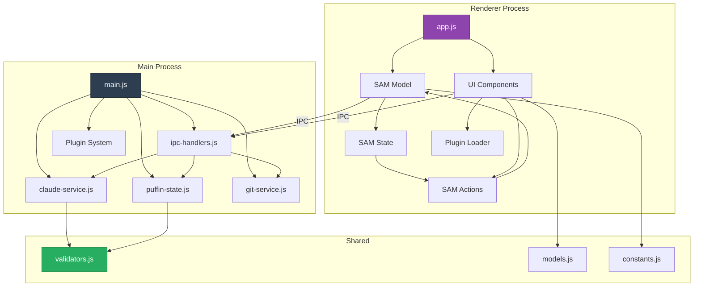

### 7.2 Data Flow

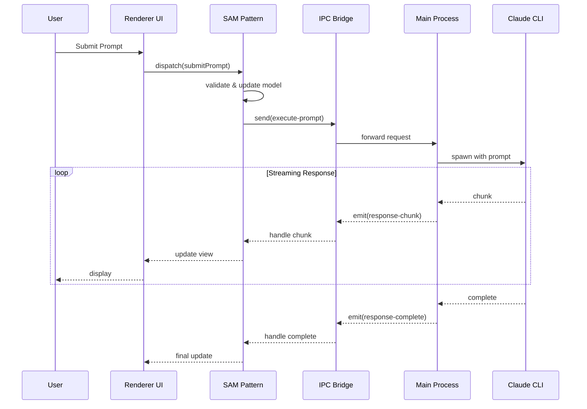

---

## 8. Formal Properties & Invariants

### System Invariants

**SI-1: Single Active Claude Process**
```
∀ t: time : |active_claude_processes(t)| ≤ 1
```

**SI-2: State Consistency**
```
renderer_state.prompt_status = 'streaming' ⟹
main_process.claude_session ≠ null
```

**SI-3: History Monotonicity**
```
∀ t₁, t₂: time : t₁ < t₂ ⟹
|conversation_history(t₁)| ≤ |conversation_history(t₂)|
```

**SI-4: Project Path Invariant**
```
application_state = 'ready' ⟹
current_project_path ≠ null ∧
exists(current_project_path + '/.puffin')
```

### Liveness Properties

**L-1: Progress Guarantee**
```
prompt_submitted ⟹ ◇(response_received ∨ error_reported)
```
(Eventually, every submitted prompt gets a response or error)

**L-2: UI Responsiveness**
```
user_action ⟹ ◇(ui_updated)
```
(Every user action eventually results in UI update)

### Safety Properties

**S-1: No Lost Messages**
```
∀ msg: message : sent(msg) ⟹ ◇received(msg)
```

**S-2: State Machine Determinism**
```
∀ state, event : next_state(state, event) is unique
```

---

## 9. Security Considerations

### Secure IPC Bridge (Preload Script)

The preload script creates a secure bridge between Main and Renderer processes:

```
Renderer Context (Untrusted) ←→ Context Bridge ←→ Main Process (Trusted)
```

**Security Properties:**
- No direct Node.js API access from renderer
- Validated IPC message schemas
- No arbitrary code execution paths
- File system access restricted to project directory

### Input Validation Chain

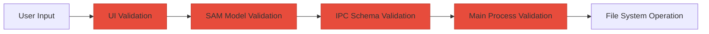

---

## 10. Extensibility: Plugin System

### Plugin Architecture

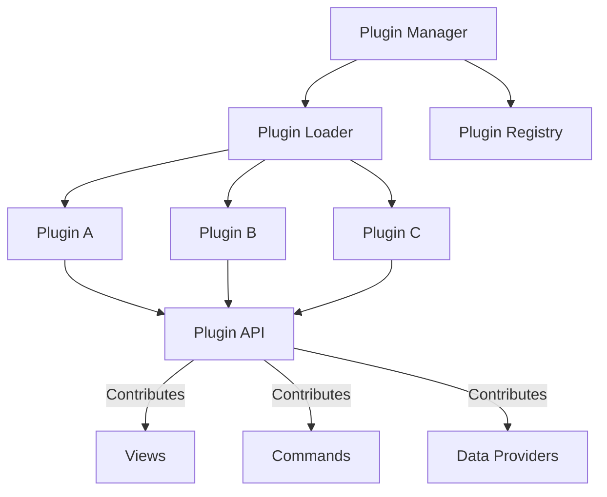

**Plugin Specification:**
```
PLUGIN = ⟨ manifest, activate, deactivate, contributions ⟩

manifest = {
    id: STRING,
    version: SEMVER,
    dependencies: SET(PLUGIN_ID),
    activationEvents: SET(EVENT)
}

contributions = {
    views: SET(VIEW_CONTRIBUTION),
    commands: SET(COMMAND_CONTRIBUTION),
    providers: SET(PROVIDER_CONTRIBUTION)
}
```

---

## 11. Conclusion

This overview presents Puffin as a formally specified system with clear architectural layers, state machines, and refinement relationships. The B-method inspired approach provides:

1. **Formal Specifications**: Clear contracts for each component
2. **Refinement Layers**: Traceable implementation from abstract to concrete
3. **Invariant Properties**: Mathematically expressible system constraints
4. **Visual Models**: Mermaid diagrams for architecture understanding

**Next Steps for Readers:**
- Review module catalog (Section 6) for detailed component specifications
- Examine state machines (Section 4) for behavior understanding
- Consult dependency graph (Section 7) for integration points
- Reference security considerations (Section 9) for secure development

---

*Generated by automated source code analysis*  
*Project: Puffin - A GUI for Claude Code*  
*Repository: https://github.com/roehst/puffin*
